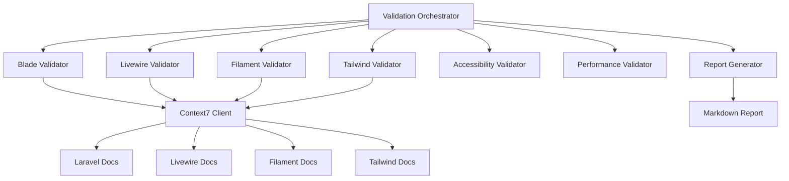

# Design Document

## Overview

Frontend Validation System adalah tool audit komprehensif yang memvalidasi semua tampilan frontend aplikasi wisuda terhadap dokumentasi terbaru dari stack teknologi yang digunakan. Sistem ini menggunakan Context7 untuk mengakses dokumentasi real-time dan menghasilkan laporan detail dengan rekomendasi perbaikan.

### Technology Stack
- **Laravel 12**: Framework PHP dengan Blade templating engine
- **Livewire 3**: Full-stack framework untuk dynamic UI
- **Filament 3.2**: Admin panel builder dengan TALL stack
- **Tailwind CSS 4**: Utility-first CSS framework dengan @theme directive
- **Context7**: Documentation access untuk validasi real-time

### Validation Scope
1. Blade Templates (resources/views/**/*.blade.php)
2. Livewire Components (app/Livewire/*.php + views)
3. Filament Resources (app/Filament/**/*.php)
4. Tailwind CSS Configuration (resources/css/app.css)
5. Component Styling dan Accessibility

## Architecture

### System Components



### Validation Flow

1. **Discovery Phase**: Scan dan identifikasi semua file yang perlu divalidasi
2. **Context Loading**: Load dokumentasi relevan dari Context7
3. **Validation Phase**: Jalankan validator untuk setiap kategori
4. **Analysis Phase**: Analisis temuan dan prioritaskan issues
5. **Reporting Phase**: Generate laporan komprehensif dengan rekomendasi

## Components and Interfaces

### 1. Validation Orchestrator

**Purpose**: Koordinasi seluruh proses validasi dan manajemen workflow

**Interface**:
```php
interface ValidationOrchestrator
{
    public function discover(): FileCollection;
    public function validate(FileCollection $files): ValidationResult;
    public function generateReport(ValidationResult $result): Report;
}
```

**Responsibilities**:
- Scan file system untuk menemukan semua file yang perlu divalidasi
- Koordinasi eksekusi validator secara parallel
- Aggregate hasil dari semua validator
- Trigger report generation

### 2. Blade Validator

**Purpose**: Validasi Blade templates terhadap Laravel 12 best practices

**Validation Checks**:
- **Directive Usage**: Validasi penggunaan @directives (deprecated vs current)
- **Component Syntax**: Validasi <x-component> syntax dan props
- **Template Inheritance**: Validasi @extends, @section, @yield patterns
- **Data Binding**: Validasi {{ }} vs {!! !!} usage
- **Control Structures**: Validasi @if, @foreach, @forelse patterns

**Key Patterns to Detect**:
```blade
<!-- DEPRECATED: Old @include patterns -->
@include('view.name', $data)

<!-- RECOMMENDED: Component-based approach -->
<x-view-name :data="$data" />

<!-- DEPRECATED: @php blocks for logic -->
@php
    $computed = expensive_operation();
@endphp

<!-- RECOMMENDED: Computed properties in component -->
{{ $this->computedValue }}
```

**Interface**:
```php
interface BladeValidator
{
    public function validateDirectives(string $content): array;
    public function validateComponents(string $content): array;
    public function validateDataBinding(string $content): array;
}
```

### 3. Livewire Validator

**Purpose**: Validasi Livewire components terhadap Livewire 3 best practices

**Validation Checks**:
- **Lifecycle Hooks**: Validasi mount(), boot(), updated() usage
- **Property Binding**: Validasi wire:model patterns
- **Event System**: Deteksi deprecated $emit, gunakan dispatch()
- **Computed Properties**: Validasi #[Computed] attribute usage
- **Wire Directives**: Validasi wire:click, wire:submit, wire:loading

**Key Patterns to Detect**:
```php
// DEPRECATED: $emit for events
$this->emit('eventName', $data);

// RECOMMENDED: dispatch() method
$this->dispatch('eventName', data: $data);

// DEPRECATED: Direct property access without #[Computed]
public function getPostsProperty() {
    return Post::all();
}

// RECOMMENDED: #[Computed] attribute
#[Computed]
public function posts() {
    return Post::all();
}
```

**Wire Directive Validation**:
```blade
<!-- DEPRECATED: wire:model without modifiers -->
<input wire:model="search">

<!-- RECOMMENDED: Explicit modifiers -->
<input wire:model.live="search">
<input wire:model.blur="email">
<input wire:model.defer="content">
```

**Interface**:
```php
interface LivewireValidator
{
    public function validateLifecycleHooks(string $classContent): array;
    public function validatePropertyBinding(string $viewContent): array;
    public function validateEventSystem(string $classContent): array;
    public function validateWireDirectives(string $viewContent): array;
}
```

### 4. Filament Validator

**Purpose**: Validasi Filament resources terhadap Filament 3.2 API

**Validation Checks**:
- **Form Components**: Validasi form field definitions
- **Table Columns**: Validasi column configurations
- **Actions**: Validasi action definitions dan modals
- **Pages**: Validasi custom page implementations
- **Widgets**: Validasi widget configurations

**Key Patterns to Detect**:
```php
// DEPRECATED: Old action syntax
Tables\Actions\Action::make('view')
    ->url(fn ($record) => route('view', $record))

// RECOMMENDED: New action syntax with proper typing
Tables\Actions\ViewAction::make()
    ->url(fn (Model $record): string => route('view', $record))

// DEPRECATED: Old form field syntax
Forms\Components\TextInput::make('name')
    ->required()

// RECOMMENDED: Fluent API with better type hints
TextInput::make('name')
    ->required()
    ->maxLength(255)
    ->autofocus()
```

**Interface**:
```php
interface FilamentValidator
{
    public function validateFormComponents(string $content): array;
    public function validateTableColumns(string $content): array;
    public function validateActions(string $content): array;
    public function validatePages(string $content): array;
}
```

### 5. Tailwind Validator

**Purpose**: Validasi Tailwind CSS 4 usage dan @theme configuration

**Validation Checks**:
- **@theme Directive**: Validasi CSS variable definitions
- **Utility Classes**: Deteksi deprecated classes
- **CSS Variables**: Validasi var() usage vs theme()
- **Design Tokens**: Validasi consistency dengan @theme
- **Responsive Design**: Validasi breakpoint usage

**Key Patterns to Detect**:
```css
/* DEPRECATED: theme() function in CSS */
.my-class {
    background-color: theme(colors.red.500);
}

/* RECOMMENDED: Direct CSS variables */
.my-class {
    background-color: var(--color-red-500);
}

/* DEPRECATED: Old @apply patterns */
@layer components {
    .btn {
        @apply px-4 py-2 bg-blue-500;
    }
}

/* RECOMMENDED: CSS variables with @theme */
@theme {
    --color-primary: #2563eb;
}

.btn {
    padding: var(--spacing-2) var(--spacing-4);
    background-color: var(--color-primary);
}
```

**Interface**:
```php
interface TailwindValidator
{
    public function validateThemeDirective(string $content): array;
    public function validateUtilityClasses(string $content): array;
    public function validateCSSVariables(string $content): array;
    public function validateDesignTokens(string $content): array;
}
```

### 6. Accessibility Validator

**Purpose**: Validasi WCAG compliance dan semantic HTML

**Validation Checks**:
- **Semantic HTML**: Validasi penggunaan proper HTML5 elements
- **ARIA Attributes**: Validasi aria-label, aria-describedby, role
- **Alt Text**: Validasi keberadaan alt pada img elements
- **Color Contrast**: Validasi contrast ratio menggunakan design tokens
- **Keyboard Navigation**: Validasi tabindex dan focus states

**Interface**:
```php
interface AccessibilityValidator
{
    public function validateSemanticHTML(string $content): array;
    public function validateARIA(string $content): array;
    public function validateAltText(string $content): array;
    public function validateColorContrast(array $designTokens): array;
}
```

### 7. Performance Validator

**Purpose**: Deteksi performance issues dan optimization opportunities

**Validation Checks**:
- **Inline Styles**: Deteksi excessive inline styles
- **Lazy Loading**: Validasi Livewire lazy loading usage
- **Asset Optimization**: Validasi defer/async attributes
- **N+1 Queries**: Deteksi potential N+1 di Livewire components
- **Caching**: Validasi computed property caching

**Interface**:
```php
interface PerformanceValidator
{
    public function validateInlineStyles(string $content): array;
    public function validateLazyLoading(string $content): array;
    public function validateAssetOptimization(string $content): array;
    public function validateQueryOptimization(string $content): array;
}
```

### 8. Context7 Client

**Purpose**: Interface untuk mengakses dokumentasi dari Context7

**Interface**:
```php
interface Context7Client
{
    public function getDocumentation(string $library, string $topic, int $tokens = 3000): string;
    public function resolveLibraryId(string $libraryName): string;
}
```

**Supported Libraries**:
- Laravel 12: `/websites/laravel_12_x`
- Livewire 3: `/livewire/livewire`
- Filament 3: `/websites/filamentphp`
- Tailwind CSS 4: `/websites/tailwindcss`

## Data Models

### ValidationResult

```php
class ValidationResult
{
    public array $bladeIssues = [];
    public array $livewireIssues = [];
    public array $filamentIssues = [];
    public array $tailwindIssues = [];
    public array $accessibilityIssues = [];
    public array $performanceIssues = [];
    
    public function addIssue(string $category, Issue $issue): void;
    public function getIssuesByPriority(string $priority): array;
    public function getTotalIssues(): int;
}
```

### Issue

```php
class Issue
{
    public string $file;
    public int $line;
    public string $category;
    public string $priority; // critical, high, medium, low
    public string $message;
    public string $currentCode;
    public string $recommendedCode;
    public string $documentationLink;
    public array $context;
}
```

### Report

```php
class Report
{
    public string $title;
    public DateTime $generatedAt;
    public array $summary;
    public array $issuesByCategory;
    public array $issuesByPriority;
    public array $recommendations;
    
    public function toMarkdown(): string;
    public function toJson(): string;
}
```

## Error Handling

### Validation Errors

1. **File Not Found**: Skip file dan log warning
2. **Parse Error**: Capture error, mark file sebagai unparseable
3. **Context7 Unavailable**: Continue dengan validasi parsial, log warning
4. **Invalid Syntax**: Capture dan report sebagai critical issue

### Error Recovery Strategy

```php
try {
    $result = $validator->validate($file);
} catch (ParseException $e) {
    $result->addIssue('parse_error', new Issue([
        'file' => $file,
        'priority' => 'critical',
        'message' => 'Unable to parse file: ' . $e->getMessage(),
    ]));
} catch (Context7Exception $e) {
    Log::warning('Context7 unavailable, continuing with partial validation');
    $result = $validator->validateWithoutContext($file);
}
```

## Testing Strategy

### Unit Tests

1. **Validator Tests**: Test setiap validator secara isolated
2. **Pattern Detection**: Test regex patterns untuk detection
3. **Context7 Client**: Mock Context7 responses
4. **Report Generation**: Test markdown output format

### Integration Tests

1. **End-to-End Validation**: Test full validation flow
2. **File Discovery**: Test file scanning logic
3. **Report Accuracy**: Validate report content

### Test Data

```php
// Sample Blade template with issues
$deprecatedBlade = <<<'BLADE'
@php
    $users = User::all();
@endphp

@foreach($users as $user)
    <div style="color: red;">{{ $user->name }}</div>
@endforeach
BLADE;

// Expected issues
$expectedIssues = [
    [
        'category' => 'blade',
        'priority' => 'medium',
        'message' => 'Avoid @php blocks, use computed properties',
    ],
    [
        'category' => 'performance',
        'priority' => 'high',
        'message' => 'Potential N+1 query detected',
    ],
    [
        'category' => 'performance',
        'priority' => 'low',
        'message' => 'Inline styles detected, use Tailwind classes',
    ],
];
```

## Implementation Notes

### Priority Levels

- **Critical**: Breaking changes, security issues, deprecated features yang akan dihapus
- **High**: Anti-patterns, performance issues, accessibility violations
- **Medium**: Style inconsistencies, missing best practices
- **Low**: Optimization opportunities, minor improvements

### Report Format

```markdown
# Frontend Validation Report

Generated: 2025-10-28 10:30:00

## Summary

- Total Files Scanned: 45
- Total Issues Found: 23
- Critical: 2
- High: 8
- Medium: 10
- Low: 3

## Issues by Category

### Laravel Blade (5 issues)

#### Critical: Deprecated @php blocks
**File**: resources/views/welcome.blade.php:15
**Current Code**:
\`\`\`blade
@php
    $users = User::all();
@endphp
\`\`\`

**Recommended Code**:
\`\`\`php
// In component class
#[Computed]
public function users() {
    return User::all();
}
\`\`\`

**Documentation**: https://laravel.com/docs/12.x/blade#components

---

### Livewire (8 issues)

#### High: Deprecated $emit usage
**File**: app/Livewire/DataWisudawan.php:45
**Current Code**:
\`\`\`php
$this->emit('refreshData');
\`\`\`

**Recommended Code**:
\`\`\`php
$this->dispatch('refreshData');
\`\`\`

**Documentation**: https://livewire.laravel.com/docs/events

---

## Recommendations

1. **Migrate from @php blocks to computed properties** (5 occurrences)
2. **Update Livewire event system to use dispatch()** (8 occurrences)
3. **Replace theme() with CSS variables in Tailwind** (3 occurrences)
4. **Add ARIA labels to interactive elements** (7 occurrences)
\`\`\`

### Validation Rules Configuration

```php
// config/frontend-validation.php
return [
    'enabled_validators' => [
        'blade' => true,
        'livewire' => true,
        'filament' => true,
        'tailwind' => true,
        'accessibility' => true,
        'performance' => true,
    ],
    
    'severity_levels' => [
        'deprecated_features' => 'critical',
        'anti_patterns' => 'high',
        'style_inconsistencies' => 'medium',
        'optimizations' => 'low',
    ],
    
    'context7' => [
        'enabled' => true,
        'timeout' => 30,
        'max_tokens' => 3000,
    ],
    
    'report' => [
        'format' => 'markdown',
        'output_path' => storage_path('validation-reports'),
        'include_code_snippets' => true,
        'max_snippet_lines' => 10,
    ],
];
```

## Performance Considerations

1. **Parallel Validation**: Jalankan validator secara parallel menggunakan Laravel queues
2. **Caching**: Cache Context7 documentation responses
3. **Incremental Validation**: Support untuk validasi file yang berubah saja
4. **Memory Management**: Process file dalam batches untuk large codebases

## Security Considerations

1. **File Access**: Validasi hanya file dalam workspace
2. **Code Execution**: Tidak execute code, hanya static analysis
3. **Report Storage**: Store reports di secure location
4. **Sensitive Data**: Redact sensitive information dari reports
