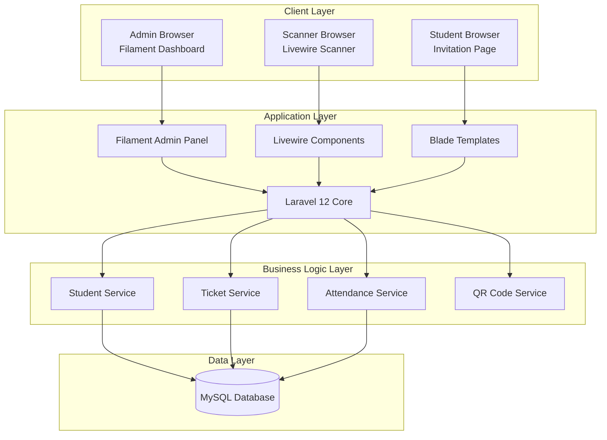
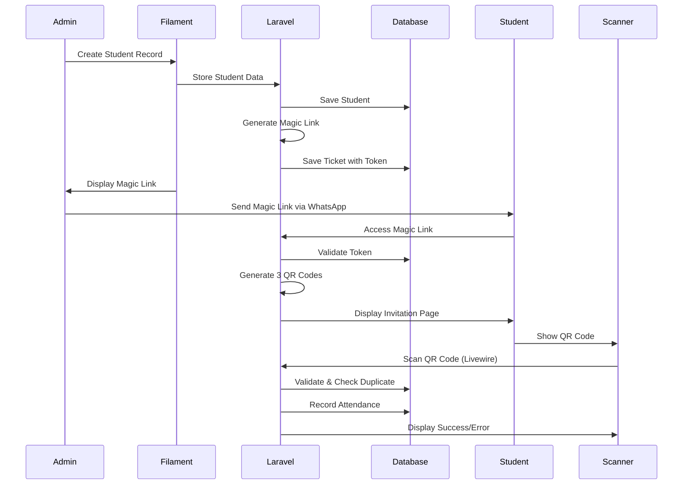

# Design Document - Sistem Absensi Wisuda Digital

## Overview

Sistem Absensi Wisuda Digital adalah aplikasi web berbasis Laravel 12 yang mengintegrasikan Filament untuk admin dashboard dan Livewire untuk aplikasi scanner real-time. Sistem ini dirancang untuk mengelola kehadiran mahasiswa dan pendamping mereka pada acara wisuda menggunakan teknologi QR code.

### Technology Stack

- **Backend Framework**: Laravel 12
- **Admin Panel**: Filament v3
- **Frontend Interactivity**: Livewire v3 + Alpine.js
- **Styling**: Tailwind CSS v3
- **Database**: MySQL 8.0+
- **QR Code Generation**: SimpleSoftwareIO/simple-qrcode
- **QR Code Scanner**: html5-qrcode (JavaScript library)
- **PDF Generation**: barryvdh/laravel-dompdf
- **Maps Integration**: Google Maps Embed API

## Architecture

### System Architecture Diagram



### Application Flow



## Components and Interfaces

### 1. Database Schema

#### Table: `users`
```sql
- id: bigint (PK)
- name: varchar(255)
- email: varchar(255) UNIQUE
- password: varchar(255)
- role: enum('admin', 'scanner') DEFAULT 'scanner'
- created_at: timestamp
- updated_at: timestamp
```

#### Table: `mahasiswa`
```sql
- id: bigint (PK)
- nim: varchar(20) UNIQUE
- nama: varchar(255)
- program_studi: varchar(255)
- fakultas: varchar(255)
- email: varchar(255) NULLABLE
- phone: varchar(20) NULLABLE
- created_at: timestamp
- updated_at: timestamp
```

#### Table: `graduation_events`
```sql
- id: bigint (PK)
- name: varchar(255)
- date: date
- time: time
- location_name: varchar(255)
- location_address: text
- location_lat: decimal(10,8) NULLABLE
- location_lng: decimal(11,8) NULLABLE
- is_active: boolean DEFAULT true
- created_at: timestamp
- updated_at: timestamp
```

#### Table: `graduation_tickets`
```sql
- id: bigint (PK)
- mahasiswa_id: bigint (FK -> mahasiswa.id)
- graduation_event_id: bigint (FK -> graduation_events.id)
- magic_link_token: varchar(255) UNIQUE
- qr_token_mahasiswa: text
- qr_token_pendamping1: text
- qr_token_pendamping2: text
- is_distributed: boolean DEFAULT false
- distributed_at: timestamp NULLABLE
- expires_at: timestamp
- created_at: timestamp
- updated_at: timestamp
```

#### Table: `attendances`
```sql
- id: bigint (PK)
- graduation_ticket_id: bigint (FK -> graduation_tickets.id)
- role: enum('mahasiswa', 'pendamping1', 'pendamping2')
- scanned_by: bigint (FK -> users.id) NULLABLE
- scanned_at: timestamp
- created_at: timestamp
- updated_at: timestamp
- UNIQUE(graduation_ticket_id, role)
```

### 2. Models

#### `User` Model
```php
- Extends Authenticatable
- Implements FilamentUser
- Relationships: attendances (hasMany)
- Scopes: admins(), scanners()
```

#### `Mahasiswa` Model
```php
- Relationships: 
  - graduationTickets (hasMany)
- Accessors: full_name
- Methods: getActiveTicket()
```

#### `GraduationEvent` Model
```php
- Relationships:
  - graduationTickets (hasMany)
- Scopes: active(), upcoming()
- Methods: getMapEmbedUrl()
```

#### `GraduationTicket` Model
```php
- Relationships:
  - mahasiswa (belongsTo)
  - graduationEvent (belongsTo)
  - attendances (hasMany)
- Methods:
  - generateMagicLink()
  - generateQRTokens()
  - isExpired()
  - getAttendanceStatus()
```

#### `Attendance` Model
```php
- Relationships:
  - graduationTicket (belongsTo)
  - scannedBy (belongsTo User)
- Scopes: byRole(), today()
```

### 3. Services

#### `TicketService`
```php
class TicketService
{
    public function createTicket(Mahasiswa $mahasiswa, GraduationEvent $event): GraduationTicket
    public function generateMagicLink(GraduationTicket $ticket): string
    public function generateQRTokens(GraduationTicket $ticket): array
    public function validateMagicLink(string $token): ?GraduationTicket
    public function markAsDistributed(GraduationTicket $ticket): void
}
```

#### `QRCodeService`
```php
class QRCodeService
{
    public function generateQRCode(string $data): string // Returns base64 image
    public function encryptQRData(array $data): string
    public function decryptQRData(string $encrypted): ?array
    public function validateQRSignature(array $data): bool
}
```

#### `AttendanceService`
```php
class AttendanceService
{
    public function recordAttendance(string $qrData, ?User $scanner): array
    public function validateQRCode(string $qrData): array
    public function checkDuplicate(int $ticketId, string $role): bool
    public function getStatistics(?GraduationEvent $event = null): array
}
```

#### `PDFService`
```php
class PDFService
{
    public function generateInvitationPDF(GraduationTicket $ticket): string // Returns PDF path
}
```

### 4. Filament Resources

#### `MahasiswaResource`
```php
- Table columns: NIM, Nama, Program Studi, Fakultas
- Filters: Program Studi, Fakultas
- Actions: 
  - Create Ticket (bulk action)
  - View Ticket
  - Copy Magic Link
  - Send WhatsApp
- Form fields: NIM, Nama, Program Studi, Fakultas, Email, Phone
```

#### `GraduationEventResource`
```php
- Table columns: Name, Date, Time, Location, Active Status
- Filters: Active, Date Range
- Actions: Set Active, View Statistics
- Form fields: Name, Date, Time, Location details, Map coordinates
```

#### `GraduationTicketResource`
```php
- Table columns: Mahasiswa, Event, Status, Distributed, Attendance Status
- Filters: Event, Distributed Status, Attendance Status
- Actions:
  - Copy Magic Link
  - Send WhatsApp
  - Regenerate QR Codes
  - View Invitation
- Infolist: Display ticket details with QR codes preview
```

#### `AttendanceResource`
```php
- Table columns: Mahasiswa, Role, Event, Scanned At, Scanned By
- Filters: Event, Role, Date Range, Scanner
- Actions: Export (CSV, Excel)
- Widgets: Statistics Cards (Total, Mahasiswa, Pendamping 1, Pendamping 2)
```

### 5. Livewire Components

#### `Scanner` Component
```php
class Scanner extends Component
{
    public string $status = 'ready'; // ready, scanning, success, error
    public ?array $scanResult = null;
    public string $errorMessage = '';
    
    public function scanQRCode(string $qrData): void
    public function resetScanner(): void
    public function render(): View
}
```

**Template Structure:**
- Camera viewfinder area
- Status indicator (ready/scanning)
- Success screen (green background, student info)
- Error screen (red background, error message)
- Auto-reset after 3 seconds

### 6. Controllers

#### `InvitationController`
```php
class InvitationController extends Controller
{
    public function show(string $token): View
    public function downloadPDF(string $token): Response
}
```

### 7. Routes

```php
// Web Routes
Route::get('/invitation/{token}', [InvitationController::class, 'show'])
    ->name('invitation.show');
Route::get('/invitation/{token}/download', [InvitationController::class, 'downloadPDF'])
    ->name('invitation.download');

// Livewire Routes (auto-registered)
Route::get('/scanner', Scanner::class)
    ->middleware(['auth'])
    ->name('scanner');

// Filament Routes (auto-registered)
// /admin/* - Filament admin panel routes
```

## Data Models

### QR Code Data Structure

Each QR code contains encrypted JSON data:

```json
{
    "ticket_id": 123,
    "role": "mahasiswa|pendamping1|pendamping2",
    "event_id": 1,
    "signature": "encrypted_hash",
    "timestamp": "2025-10-27T10:00:00Z"
}
```

### Magic Link Structure

```
https://domain.com/invitation/{encrypted_token}
```

Token contains:
- Ticket ID
- Expiration timestamp
- Signature for validation

### Attendance Record Structure

```php
[
    'graduation_ticket_id' => 123,
    'role' => 'mahasiswa',
    'scanned_by' => 1,
    'scanned_at' => '2025-10-27 10:30:00'
]
```

## Error Handling

### Error Types and Responses

#### 1. Invalid Magic Link
- **Scenario**: Token expired or invalid
- **Response**: Display error page with message "Link tidak valid atau sudah kadaluarsa"
- **HTTP Status**: 404

#### 2. Invalid QR Code
- **Scenario**: QR data cannot be decrypted or signature invalid
- **Response**: Scanner shows red screen with "QR Code tidak valid"
- **Action**: Auto-reset after 3 seconds

#### 3. Duplicate Scan
- **Scenario**: QR code for specific role already scanned
- **Response**: Scanner shows red screen with "Sudah melakukan absensi sebelumnya"
- **Action**: Auto-reset after 3 seconds

#### 4. Expired Ticket
- **Scenario**: Ticket expiration date passed
- **Response**: Scanner shows red screen with "Tiket sudah kadaluarsa"
- **Action**: Auto-reset after 3 seconds

#### 5. Camera Permission Denied
- **Scenario**: User denies camera access
- **Response**: Display message "Izinkan akses kamera untuk memindai QR Code"
- **Action**: Show button to request permission again

### Logging Strategy

```php
// Log all scan attempts
Log::channel('attendance')->info('QR Scan Attempt', [
    'qr_data' => $encrypted,
    'scanner_id' => auth()->id(),
    'result' => 'success|failed',
    'reason' => 'duplicate|invalid|expired'
]);

// Log magic link access
Log::channel('invitation')->info('Magic Link Access', [
    'token' => $token,
    'ip' => request()->ip(),
    'user_agent' => request()->userAgent()
]);
```

## Testing Strategy

### Unit Tests

1. **TicketService Tests**
   - Test magic link generation uniqueness
   - Test QR token generation
   - Test magic link validation

2. **QRCodeService Tests**
   - Test encryption/decryption
   - Test signature validation
   - Test QR code image generation

3. **AttendanceService Tests**
   - Test duplicate detection
   - Test attendance recording
   - Test statistics calculation

### Feature Tests

1. **Admin Panel Tests**
   - Test mahasiswa CRUD operations
   - Test ticket creation
   - Test magic link copying
   - Test statistics display

2. **Invitation Page Tests**
   - Test valid magic link access
   - Test invalid magic link handling
   - Test QR code display
   - Test PDF download

3. **Scanner Tests**
   - Test valid QR code scanning
   - Test duplicate scan prevention
   - Test invalid QR code handling
   - Test success/error display

### Browser Tests (Dusk)

1. **End-to-End Flow**
   - Admin creates student and ticket
   - Student accesses invitation page
   - Scanner scans QR code
   - Verify attendance recorded

2. **Scanner UI Tests**
   - Test camera initialization
   - Test QR code detection
   - Test success screen display
   - Test auto-reset functionality

## Security Considerations

### 1. Token Security
- Magic link tokens use Laravel's encryption
- Tokens include expiration timestamp
- Tokens are single-use per event

### 2. QR Code Security
- QR data is encrypted using AES-256
- Each QR includes HMAC signature
- Timestamp prevents replay attacks
- Role-based validation prevents misuse

### 3. Authentication
- Admin panel protected by Filament auth
- Scanner app requires authentication
- Role-based access control (admin vs scanner)

### 4. Rate Limiting
- Magic link access: 10 requests per minute per IP
- Scanner API: 30 requests per minute per user
- PDF download: 5 requests per minute per token

### 5. Input Validation
- All form inputs validated using Laravel Form Requests
- QR data validated before decryption
- SQL injection prevention via Eloquent ORM

## Performance Optimization

### 1. Database Optimization
- Indexes on: nim, magic_link_token, qr_tokens, graduation_ticket_id + role
- Eager loading for relationships
- Query caching for statistics

### 2. Caching Strategy
```php
// Cache graduation event details
Cache::remember('graduation_event_active', 3600, fn() => GraduationEvent::active()->first());

// Cache attendance statistics
Cache::remember('attendance_stats_' . $eventId, 60, fn() => AttendanceService::getStatistics($eventId));
```

### 3. Asset Optimization
- Tailwind CSS purging for production
- Livewire asset bundling
- QR code images cached in browser

### 4. PDF Generation
- Generate PDF asynchronously if needed
- Cache generated PDFs for 24 hours
- Optimize PDF size with compression

## Deployment Considerations

### Environment Variables
```env
APP_URL=https://wisuda.domain.com
DB_CONNECTION=mysql
DB_HOST=127.0.0.1
DB_PORT=3306
DB_DATABASE=wisuda
DB_USERNAME=root
DB_PASSWORD=Srid3v1@#14
GOOGLE_MAPS_API_KEY=your_api_key
QR_ENCRYPTION_KEY=your_encryption_key
WHATSAPP_API_URL=https://wa.me/
```

**Note**: Password contains special characters that may need escaping in some contexts.

### Server Requirements
- PHP 8.2+
- MySQL 8.0+
- Composer 2.x
- Node.js 18+ (for asset compilation)
- SSL Certificate (required for camera access)

### Queue Configuration
- Use queue for sending bulk WhatsApp messages
- Use queue for PDF generation if needed
- Redis recommended for queue driver

## UI/UX Design Guidelines

### Admin Dashboard (Filament)
- Use Filament's default theme with custom primary color
- Responsive tables with mobile-friendly actions
- Clear statistics widgets on dashboard
- Intuitive navigation structure

### Invitation Page
- Mobile-first responsive design
- Clean, elegant layout with university branding
- Large, scannable QR codes
- Clear visual hierarchy
- Download button prominently displayed

### Scanner Application
- Full-screen camera viewfinder
- Minimal UI distractions
- Large, clear feedback messages
- High contrast colors (green/red)
- Audio feedback for successful scans

### Color Scheme
```css
Primary: #1e40af (Blue)
Success: #16a34a (Green)
Error: #dc2626 (Red)
Background: #f9fafb (Light Gray)
Text: #111827 (Dark Gray)
```
